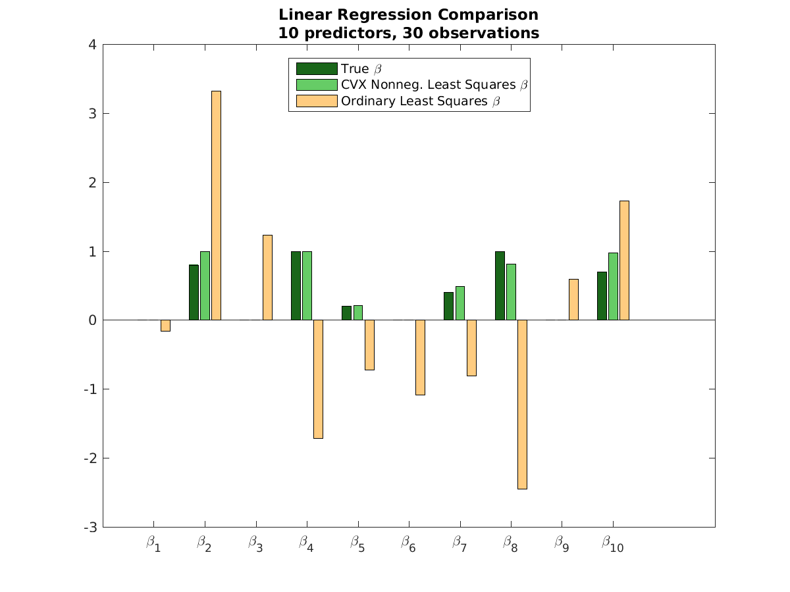

```{r, message=FALSE, warning=FALSE}
library(MASS)
library(ggplot2)
library(Rmisc)
#library(CVXR)
```

# 1 Introduction

Welcome to `CVXR`: a modeling language for describing and solving convex optimization problems that follows the natural, mathematical notation of convex optimization rather than the requirements of any particular solver. The purpose of this document is both to introduce the reader to `CVXR` and to generate excitement for the possibilities it creates in the field of statistics.

Convex optimization is a powerful and very general tool. As a practical matter, the set of convex optimization problems includes almost every optimization problem that can be solved exactly and efficiently (i.e. without requiring an exhaustive search). If an optimization problem can be solved, it is probably convex. This family of problems becomes even larger if you include those that can be solved _approximately_ and efficiently. To learn more about the mathematics and application of convex optimization, see [Boyd and Vandenberghe 2009](http://stanford.edu/~boyd/cvxbook/).

Convex optimization systems written in other languages are already widely used in practical applications. These include [YALMIP](http://users.isy.liu.se/johanl/yalmip/pmwiki.php?n=Main.WhatIsYALMIP) and [CVX](http://cvxr.com/cvx/) (Matlab), [CVXPY](http://www.cvxpy.org/en/latest/) (Python), and [Convex.jl](http://convexjl.readthedocs.org/en/latest/) (Julia). `CVXR` Shares a lot of its code base with [CVXcannon](http://stanford.edu/class/ee364b/projects/2015projects/reports/miller_quigley_zhu_report.pdf) and CVXPY. As far as we know, this is the first full-featured general convex optimization package for R.

One of the great headaches of conventional numerical optimization is the process of deciding which algorithm to use and how to set its parameters. In convex optimization, the particular algorithm matters much less. So while a user of `CVXR` is still free to choose from a number of different algorithms and to set algorithm parameters as they please, the vast majority of users will not need to do this. `CVXR` will just work.

The uses for convex optimization in statistics are many and varied. Many parameter-fitting methods are convex, including least-squares, ridge, lasso, and isotonic regression, as well as many other kinds of problems such as maximum entropy or minimum Kullback-Leibler divergence over a finite set. All of these examples, at least in their most basic forms, are established enough that they already have well-crafted R packages devoted to them. If you use `CVXR` to solve these problems, it will work. It will probably be slower than a custom-built algorithm---for example glmnet for fitting lasso or ridge regression models---but it will work. However, this is not the true purpose of `CVXR`. If you want to build a well-established model, you should use one of the well-established packages for doing so. If you want to build your _own_ model---one that is a refinement of an existing method, or perhaps even something that has never been tried before---then `CVXR` is the place to do it. The advantage of `CVXR` over glmnet and the like comes from its flexibility: A few lines of code can transform a problem from commonplace to state-of-the-art, and can often do the work of an entire package in the process. (We present an example in section 3 where this is literally the case.)

The rest of this document presents a sequence of examples, starting from the simple and mundane and building up towards methods of increasing complexity and novelty, including some methods that are state-of-the-art at the time of writing and others that are as-yet-unexplored to our knowledge. Enjoy!


# 2 'Hello World'

A convex optimization problem has the following form

$$
\begin{aligned}
\text{minimize }& f_0(x) \\
\text{subject to: }& f_i(x) \leq 0, \; i = 1,...,m \\
& g_i(x) = 0, \; i = 1,...,p,
\end{aligned}
$$

where $f_0$ and $f_1,...,f_m$ are convex and $g_1,...,g_p$ are affine. $f_0$ is called the objective function, $f_i \leq 0$ are called the inequality constraints, and $g_i = 0$ are called the equality constraints. We begin with one of the simplest possible problems that presents all three of these features:

## Example 2.1: `Hello World'

```{#numCode .R .numberLines}
# Variables used to try to minimize the objective
x <- Variable(1)
y <- Variable(1)

# Problem definition
objective <- Minimize(x^2 + y^2)
constraints <- Constraints(x >= 0,
                   x + 2*y == 1)
prob2.1 <- Problem(objective, constraints)

# Problem solution
solution2.1 <- Solve(prob2.1)
solution2.1$status
solution2.1$opt.value
solution2.1$x
solution2.1$y

# The world says 'hi' back.
```

Note that this problem is simple enough to be solved analytically, so we can confirm that `CVXR` has produced the correct answer.

We now turn to a careful explanation of the code. Lines 2 and 3 create two Variable objects, `x` and `y`. They represent what we are allowed to adjust in our problem in order to obtain the optimal solution. They don't have values yet, and they won't until after we solve the problem. For now, they are just placeholders.

In line 6, the call to `Minimize()` does _not_ return the minimum value of the expression `x^2 + y^2` the way a call to the native R function `min()` would do (after all, `x` and `y` don't have values yet!). Instead, `Minimize()` creates an Objective object, which defines the goal of the optimization we will perform, namely to find values for `x` and `y` which produce the smallest possible value of `x^2 + y^2`.

Lines 7 and 8 define an inequality constraint and an equality constraint, respectively. Again, counter to what you might ordinarily expect, the expression `x >= 0` does not return `TRUE` or `FALSE` the way `1.3 >= 0` would. Instead, the `==` and `>=` operators have been overloaded to return Constraint objects which will be used by the solver to enforce the problem's constraints. (Without them, the solution to our problem would simply be $x = y = 0$.)

In line 9, we define our Problem object, which takes our Objective object and our two Constraint objects as inputs. Problem objects are very flexible in that they can have 0 or more Constraints, and their Objective can be to `Minimize()` a convex expression (as shown above) _or_ to `Maximize()` a concave expression. You can even create a Problem object with no Objective, in which case the corresponding problem is called a "feasibility problem," where the implicit objective is simply to find out whether or not it is possible to simultaneously satisfy all of the given constraints.

The call to `Problem()` still does not actually _solve_ our optimization problem. That happens on line 12 with the call to `Solve()`. Behind the scenes, this call translates the problem into a format that a convex solver can understand, feeds the problem to the solver, and then returns the results to a Solution object.  For the problem above, the Solution object will contain among other things the optimal value of the objective function `x^2 + y^2`, values for `x` and `y` that achieve that optimal objective value, and some accompanying metadata such as `solution$status`, which confirms that the solution was indeed `"optimal"` (see lines 13 through 16).

In general when you apply the `Solve()` method to a Problem, several things can happen:

1. `solution$status == "optimal"`: The problem is solved. Values for the optimization variables are found which satisfy all of the constraints and minimize the objective.

2. `solution$status == "infeasible"`: The problem was _not_ solved because no combination of input variables exists that can satisfy all of the constraints. For a trivial example of when this might happen, consider a problem with optimization variable `x`, and constraints `x >= 1` and `x <= 0`. Obviously, no value of `x` exists that can satisfy both constraints. In this case, `solution$opt.val` is `+Inf` for a minimization problem and `-Inf` for a maximization problem, indicating infinite dissatisfaction with the result. No values are returned for the input variables.

3. `solution$status == "unbounded"`: The problem was _not_ solved because the Objective can be made arbitrarily small for a minimization problem or arbitrarily large for a maximization problem. Hence there is no optimal solution because for any given solution it is always possible to find something even more optimal. In this case, `solution$opt.val` is `-Inf` for a minimization problem and `+Inf` for a maximization problem, indicating infinite satisfaction with the result. Again, no values are returned for the input variables.

4. Others?

Like any normal R object, the Problem, Objective, Constraint, and Solution objects can all be modified and computed on after creation. Here is an example where we modify the problem we created on line 9 by changing its objective and adding a constraint, print the modified problem, check whether it is still convex, and then solve the modified problem:

## Example 2.2: Modifying a CVXR Problem

```{r, eval=FALSE}
# Modifying the problem from example 1
prob2.2 <- prob2.1
prob2.2$objective <- Minimize(x^2 + y^2 + abs(x-y))
prob2.2$constraints <- list(prob2.2$constraints, Constraint(y <= 1))

# Analyzing the modified problem
print(prob2.2)
is.convex(prob2.2)

# Solving the modified problem
solution2.2 <- Solve(prob2.2)

# Examining the solution
solution2.2$status
solution2.2$opt.val
solution2.2$x
solution2.2$y
```

Unfortunately, you can't just type any problem you like into `CVXR`. There are severe restrictions on what kinds of problems can be handled. For example, if we tried to maximize the objective from example 2.1, we get an error:

## Example 2.3: Non-Convex Objective

```{r, eval=FALSE}
prob2.3 <- prob2.1
prob2.3$objective <- Maximize(x^2 + y^2)
Solve(prob2.3)
```

If we tried to add the constraint $x^2 == 0.5$, we get a similar error:

## Example 2.4: Non-Convex Constraint

```{r, eval=FALSE}
prob2.4 <- prob2.1
prob2.4$constraints <- c(prob2.3$constraints, Constraint(x^2 == 0.5))
```

Some of these restrictions are due to the inherent mathematical limitations of convex optimization---not all problems are convex. Other restrictions come from the fact that neither `CVXR` nor any other system to date is capable of evaluating the convexity of any arbitrary expression. `CVXR` evaluates an expression's convexity using a strict set of rules called Disciplined Convex Programming. To be an effective user of `CVXR` you must understand these rules. For more information, see section [blank].


# 3 Regression

We are exploring the applications of `CVXR` to the field of statistics, so it would be remiss of us not to talk about regression. A lot. In this section, we do so through a sequence of examples of increasing complexity, though even the most complex of them is still fairly tame. This section is not meant to illustrate the vast range of what can be done with `CVXR`. We leave that task to Section 5. Instead, this section is meant to show what `CVXR` looks like in a context that should be familiar to most readers.

We begin by showing what a standard linear regression problem looks like in `CVXR`:

## Example 3.1: Ordinary Least Squares
```{r, eval=FALSE, echo=FALSE}
set.seed(1)
Sigma <- matrix( c(1.6484, -0.2096, -0.0771, -0.4088, 0.0678, -0.6337, 0.9720, -1.2158, -1.3219,
                   -0.2096, 1.9274, 0.7059, 1.3051, 0.4479, 0.7384, -0.6342, 1.4291, -0.4723,
                   -0.0771, 0.7059, 2.5503, 0.9047, 0.9280, 0.0566, -2.5292, 0.4776, -0.4552,
                   -0.4088, 1.3051, 0.9047, 2.7638, 0.7607, 1.2465, -1.8116, 2.0076, -0.3377,
                   0.0678, 0.4479, 0.9280, 0.7607, 3.8453, -0.2098, -2.0078, -0.1715, -0.3952,
                   -0.6337, 0.7384, 0.0566, 1.2465, -0.2098, 2.0432, -1.0666,  1.7536, -0.1845,
                   0.9720, -0.6342, -2.5292, -1.8116, -2.0078, -1.0666, 4.0882,  -1.3587, 0.7287,
                   -1.2158, 1.4291, 0.4776, 2.0076, -0.1715, 1.7536, -1.3587, 2.8789, 0.4094,
                   -1.3219, -0.4723, -0.4552, -0.3377, -0.3952, -0.1845, 0.7287, 0.4094, 4.8406),
                 nrow = 9, ncol = 9, byrow=TRUE)
s <- 1
mu <- rep(0, 9)
n <- 30
X <- mvrnorm(n, mu, Sigma, exact=TRUE)
X <- cbind(rep(1, n), X)
trueBeta <- rep(0, 10)
trueBeta[c(2, 4, 5, 7, 8, 10)] <- c(0.8, 1, 0.2, 0.4, 1, 0.7)
y <- X %*% trueBeta + rnorm(n, 0, s)
```

```{r, eval=FALSE}
beta <- Variable(10)
objective <- Minimize( sqrt(1/n) * norm(y - X %*% beta, 2) )
prob3.1 <- Problem(objective)
```

Here,  `y` is the response, `X` is the matrix of predictors, `n` is the number of observations, and `beta` is a vector of coefficients on the predictors. The Ordinary Least-Squares (OLS) solution for `beta` minimizes `1/n` times the the L2-norm of the residuals (i.e. the root-mean-squared-error). As we can see below, `CVXR`'s solution matches the solution obtained by using `lm`.

```{r, eval=FALSE}
CVXR_solution3.1 <- Solve(prob3.1)
lm_solution3.1 <- lm(y ~ 0 + X)
```

```{r, echo=FALSE, fig.height = 5, fig.width = 7}
lmBeta <- c(-0.1564, 3.3242, 1.2300, -1.7095, -0.7192, -1.0866, -0.8085, -2.4432, 0.5941, 1.7332)
CVXRBeta <- c(-0.1564, 3.3242, 1.2300, -1.7095, -0.7192, -1.0866, -0.8085, -2.4432, 0.5941, 1.7332)
coefs <- data.frame( estimate = c(lmBeta, CVXRBeta),
                     method = c(rep("lm", 10), rep("CVXR", 10)),
                     beta = rep(paste("beta", 0:9, sep=""), 2))
ggplot(data = coefs, aes(x = as.factor(beta), y = estimate, fill = method)) + 
  geom_bar(stat = "identity", position = "dodge") +
  labs(title = "Comparing CVXR to lm", x= "coefficient")
```

Now, you may be thinking to yourself, "Great, so I have just done with `CVXR` what I was already capable of doing with `lm`, but slower and with more code." That's true. If all of your modeling needs are covered by a few well-designed and well-maintained packages, then you should simply use those packages. However, if you want to fit models of your *own* design, models for which well-designed packages do *not* exist, or even if you just want to explore a variety of different approaches to a problem without having to switch between half-a-dozen packages to do so, then `CVXR` is the tool for you. The chief advantage of `CVXR` is its flexibility, as we will demonstrate with the rest of this section.

## Example 3.2: Non-Negative Least Squares

Looking at Example 3.1, you may notice that the OLS regression problem has an objective but no constraints. In many contexts, we can greatly improve our model by constraining the solution to reflect our prior knowledge. For example, we may know that the coefficients `beta` must be non-negative.

```{r, eval=FALSE}
prob3.2 <- prob3.1
prob3.2$constraints <- Constraints(beta >= 0)
solution3.2 <- Solve(prob3.2)
```

```{r, echo=FALSE, out.width=700}

CVXRBeta <- c(0.0000, 1.1852, 0.0000, 1.0208, 0.1623, 0.0000, 0.5166, 0.7748, 0.0531, 1.0133)
```

As we can see in the figure above, adding that one constraint produced a massive improvement in the accuracy of the estimates. Not only are the non-negative least-squares estimates much closer to the true signal than the OLS estimates, they have even managed to recover the correct sparsity structure in this case!

As with ordinary least squares, there is already an R package implementing non-negative least squares, appropriately called `nnls`, but that is actually an excellent demonstration of the power of `CVXR`: A single line of code here, namely `prob3.2$constraints <- Constraints(beta >= 0)`, is doing the work of an entire package.

## Example 3.3: Elastic Net Penalized LS Regression

In Example 3.2, the non-negativity penalty was sufficient to recover the sparsity pattern in the data, but in general if we know that our response has sparse dependence on our predictors (or if we have more predictors than observations), then we need to use some kind of regularized regression like Lasso, Ridge, or Elastic Net (a mixture of Lasso and Ridge). Here is how we would do Elastic Net with `CVXR`:

```{r, eval=FALSE}
# Data with more predictors than observations and non-negative beta.

beta <- Variable(30)
a <- 0.2
lambda <- 0.003 # Need to cross-validate for this number
objective <- Minimize( 1/n * norm(y - X %*% beta, 2) +
                         a * lambda *  norm(beta, 2) + 
                         (1-a) * lambda * norm(beta, 1))
constraints <- Constraints(beta >= 0)
prob3.3 <- Problem(objective, constraints)

solution3.3 <- Solve(prob3.3)
```

Most of the action here is happening in the objective. We are trying to minimize a sum of three things:

* `1/n * norm(y - X %*% beta, 2)`, the ordinary Least Squares loss function,

* `a * lambda * norm(beta, 2)`, the scaled sum of the squared entries of `beta`, often called the Ridge penalty,

* and `(1-a) * lambda * norm(beta, 1)`, the scaled sum of the absolute values of the entries of `beta`, often called the Lasso penalty.

The constant `lambda`, chosen by cross-validation, controls how strongly we penalize or 'shrink' the coefficients of `beta`. The constant `a` determines what mix of Lasso and Ridge penalties we use to do that. The larger `a` is, the less sparse the solution will be: `a = 1` is Ridge regression, `a = 0` is Lasso regression, and `a = 0.2` corresponds to 20% Ridge 80% Lasso regression.

[GRAPH SHOWING FANTASTIC RESULTS FOR SHRUNKEN REGRESSION COMPARED TO POOR RESULTS FOR UNSHRUNKEN REGRESSION. HAVEN'T CREATED THIS EXAMPLE YET.]


## Example 3.4: Elastic Net Penalized LAD Regression

Elastic net penalized LS regression was extremely effective at recovering the signal structure in Example 3.3, but there are important cases where we would expect it to fail. In particular, what if there were errors in recording the response data `y`? Or what if a small subset of your observations have some unmeasured property which makes them behave very differently from the majority of your observations? In other words, what if your data contain outliers?

It's an open question, but here's one approach: replace the "Least-Squares" (LS) or minimized L2-norm part of the regularized linear regression objective with a "Least Absolute Deviation" (LAD) or minimized L1-norm. Why might this be good? LAD regression is much less sensitive to the effects of outliers, which could be especially important in contexts where the number of observations is small relative to the number of variables.

If you want unconstrained elastic net penalized LAD regression, there is a package called `hqreg` that seems to support it, but if you want non-negative coefficients, then to our knowledge no other R package can implement this model. Here's how we do it with `CVXR`:

```{r, eval=FALSE}
# generate data with fewer observations than variables and at least one outlier.
# again, stick with positive coefficients

beta <- Variable(30)
a <- 0.2
lambda <- 0.003 # Need to cross-validate for this number
objective <- Minimize( 1/n * norm(y - X %*% beta, 1) +
                         a * lambda *  norm(beta, 2) + 
                         (1-a) * lambda * norm(beta, 1))
constraints <- Constraints(beta >= 0)
prob3.4 <- Problem(objective, constraints)

solution3.4 <- Solve(prob3.4)
```

The only change from Example 3.3 is that in the objective, `norm(y - X %*% beta, 2)` was changed to `norm(y - X %*% beta, 1)`.

```{r, echo=FALSE, fig.height=5, fig.width=7}
LADbeta <- c(rep(1, 4), rep(0, 16))
LSbeta <- rep(0, 20)
LSbeta[c(1, 2, 4, 17)] <- c(3.5780, 0.6499, 0.4472, 0.3020)
TrueBeta <- c(rep(1, 4), rep(0, 16))
coefs <- data.frame( estimate = c(TrueBeta, LADbeta, LSbeta),
                     method = c(rep("Actual", 20), rep("LAD", 20), rep("LS", 20)),
                     beta = 0:19)
ggplot(data = coefs, aes(x = as.factor(beta), y = estimate, fill = method)) + 
  geom_bar(stat = "identity", position = "dodge") +
  labs(x= "coefficient (beta)") + 
  ggtitle(expression(atop("LAD vs. LS Regression with Elastic Net Regularization", atop(italic("20 predictors, 15 observations, 2 outliers"), "")))) + 
  scale_fill_manual(values=c("#196419", "#64c864", "#ff8c00"))
```

Regularized LAD regression actually recovered *exactly* the correct coefficients despite having fewer observations than predictors! By contrast, regularized LS regression (which is what is typically used with the Lasso) produced results that were *way* off despite there being only 2 outliers.

## Re: 'There's an app for that'

Before going on to our final example for this section, we want to add a brief aside about competing R packages. R has a very rich library of packages that is growing all the time. One could see this and argue that for a lot of things one might want to try in `CVXR`, packages are already available which implement them more efficiently. Thus, the usefullness of an 'all-rounder' package like `CVXR` is relegated to an ever receding fringe of edge-cases where other packages have not yet been created. We disagree.

First of all, there is a cost to having to hunt down and learn how to use a new package every time you want to make a small change to your model. Every package has its quirks, some more than others, and learning those quirks takes time and makes code more complicated to write and interpret, which can disincentivize experimentation. Reproducing the last four examples from other packages would not have been fun. `lm` would take care of Example 3.1, but for 3.2 you would have to use something like `nnls`. Example 3.3 *without* the non-negativity constraint could be handled with `glmnet`, but *with* the constraint you would need to use the package `penalized`. Unfortunately, even `penalized` cannot handle Example 3.4. For 3.4, you would have to go back to the internet until you found the package `hqreg`, which would allow you to fit LAD Regression with an Elastic Net penalty, but would *not* allow you to add the non-negativity constraint. Maybe there exists a sixth package that could handle that case, but then again, maybe not. By contrast, `CVXR` can handle all of them simply and elegantly. `CVXR` gives you the freedom to experiment with your approach to a problem within a much larger space of solutions than any other R package to date. This freedom is of particular interest to the researcher, as it makes `CVXR` an excellent platform for rapid-prototyping a new idea and seeing how it works.

In addition, the most advertized advantage of using a package specific to a particular type of problem is increased efficiency, but that advantage can be overstated. Unless a package is very well designed, there is a good chance that `CVXR`'s efficiency will be at least competitive if not superior. Besides that, unless the problem involves a huge amount of data or has to be solved repeatedly under extremely strict time requirements (in which case you wouldn't be using R anyway), efficiency is a more secondary concern. `CVXR` gives you the option to solve the problem first and then worry about whether there is a faster way to do it later if you really must.


## Example 3.5: 'Why won't CVXR let me do this?'

`CVXR` cannot solve just any problem that you type in. We already touched on this a few times in Examples 2.3 and 2.4 at the end of 'Hello World', but it is important enough to revisit at least one more time. 

For example, L1 loss is more robust than the L2 loss because it does not give such extreme weight to outlying observations. What if we wanted to exploit this concept to create a loss function that was even *more* robust than L1? One possible candidate might look like this:

```{r, echo=FALSE, fig.height = 3.8, fig.width = 7}
x <- seq(-3, 3, by = 0.01)
absx <- abs(x)
x2 <- x^2
xnew <- pmin(absx, 2)
penalties <- data.frame(x, absx, x2, xnew)

p1 <- ggplot(data = penalties, aes(x = x, y = x2)) + geom_line() + 
  labs(title = "L2 \"Ridge\" Penalty", y = "penalty", x = "residual") + 
  scale_x_continuous(breaks = -3:3, minor_breaks = -3:3) + 
  scale_y_continuous(breaks = c(0, 3, 6, 9), minor_breaks = 0:9,
                     limits = c(0, 9))

p2 <- ggplot(data = penalties, aes(x = x, y = absx)) + geom_line() +
  labs(title = "L1 \"Lasso\" Penalty", y = "penalty", x = "residual") +
  scale_x_continuous(breaks = -3:3, minor_breaks = -3:3) + 
  scale_y_continuous(breaks = c(0, 3, 6, 9), minor_breaks = 0:9,
                     limits = c(0, 9))

p3 <- ggplot(data = penalties, aes(x = x, y = xnew)) + geom_line() +
  labs(title = "Proposed Penalty", y = "penalty", x = "residual") +
  scale_x_continuous(breaks = -3:3, minor_breaks = -3:3) +
  scale_y_continuous(breaks = c(0, 3, 6, 9), minor_breaks = 0:9,
                     limits = c(0, 9))

multiplot(p1, p2, p3, cols = 3)
```

The proposed penalty is an L1 penalty up to a certain threshold and then constant beyond that. We could try to implement it like so:

```{r, eval=FALSE}
k <- 2
objective <- Minimize( min(norm(y - X %*% beta, 1), k) )
constraints <- Constraints(beta >= 0)
prob3.5 <- Problem(objective, constraints)

solution3.5 <- Solve(prob3.5)
```

[SHOW THE ERROR THAT `CVXR` RETURNS]

Why won't `CVXR` let us do this? Sometimes it seems like every other question on the CVX-family stackoverflow forums is along these lines. The answer in this case as in almost every case is that the proposed problem simply isn't convex. So before you let your question be the next one on the stack, please, consider the following:

# 4 Disciplined Convex Programming Rules: A Brief Overview

[NOTE: I WILL TURN TO THIS SECTION NEXT.]

You must understand these to be an effective user of CVXR.

Overview of DCP rules. Take the Elastic Net objective function as an example. Show the convexity parse tree. Walk through why it is convex. Walk through why the proposed penalty of Example 3.5 is *not* convex.

Conclude by pointing to another Vignette with a more complete description of DCP rules.

# 5 Extended Examples

This section contains some more sophisticated examples of `CVXR` in action.

## Example 5.1: Brand-new method for Lasso Selection of Interaction Terms

`CVXR` is extremely useful for rapid-prototyping a new idea, which makes it an invaluable tool for experimentation and research. To demonstrate, this example reproduces something completely state-of-the-art at the time of release.

Rob Tibshirani, inventor of Lasso regression among other things, is just about to publish a paper explaining how to extend the Lasso's variable-selection properties to regression with interaction terms. When selecting which interaction terms to include, we want to ensure that the interaction $x_i x_j$ is only included if both $x_i$ and $x_j$ are included as well. The upcomming paper (which will be published where?) shows how to do this using L1 regularization.

The paper will be released along with an R package which Rob and his students have been working on for months(?). Here, we implement the same method in `CVXR` with only [BLANK] lines of code.

```{r, eval=FALSE}

```

[NOTE: I CAN'T SEEM TO GET CVX TO SET ANY OF THE COEFFICIENTS TO EXACTLY 0.]


The prototype is probably less efficient than the package that Rob's group will release, but it is also more flexible. For example, the Lasso interactions package can only handle 2nd order interactions, whereas our implementation above can be extended to handle arbitrarily high order interactions. Our implementation can also incorporate additional prior information (like our old friend, the non-negativity constraint).


## Example 5.2: Direct Standardization -- Correcting Bias in a Sample

Survey Sampling: sample bias correction. find the maximum entropy distribution on n outcomes that satisfies m expectations (equalities or inequalities).  this is used in, e.g., direct standardization.   we can use it is to estimate a distribution of something from a non-random sample of it, with some known statistics for the whole distribution. "Explicit"/"Implicit standardization"
Hilary vs. Bernie in an online poll. Online poll is super biased towards young people. Bernie is going to take over the world!!! Reweight based on prior information about age in the general population. Now it looks like Hilary is going to take it.

## Example 5.3: Upper and Lower Bounds on Covariance Between Variables Given Limited Prior Information

Estimating a covariance matrix given partial information

Fit an increasing cubic spline regression to the Effectiveness vs. Compliance data? Modify to use asymmetric L1 loss for increasing local quantile regression?


# Structure of CVXR Objects

Show the tree again.

## Creating New Atoms

As CVXR grows, we will be adding new atoms, but there may well be a function that you want to use that is convex and not representable by the atoms we have. Then, you may want to create your own atom.


# Ideas:

FIND THE SIMPLEST BRILLIANT EXAMPLE WE CAN.
Nonnegative least squares example. 20 positive coefficients, only 30 observations, and epsilon is not small. Least squares then truncate negative predictions is one approach. Another approach is lasso to produce sparsity. We can do a convex optimization approach that simply constrains the beta's to be >= 0. Show how much better it is.

WHAT IS OUR DATA? We want something in 2 dimensions that works OK with least squares, better with ridge or lasso, even better with huber loss, and maybe even better with some prior knowledge (like how one of the variables has a limited range, and the response is always positive).

One way that Huber would definitely do better is if we corrupt the normal noise term with a slightly fatter normal (basically giving it slightly fatter tails). But that may seem like cheating.


Congratulations! You have just done with `CVXR` what you already could have done with `glmnet`. But slower. And with more code. Stick with us, it gets better.

There is a conspicuous absence from all of these regression problems: constraints! Constraints present a simple way that we can incorporate prior information about the system under study to produce a better prediction.

Add nuance to existing methods by incorporating prior information, or invent entirely new methods with only a few lines of code.


WE CAN REPRODUCE THE FUNCTIONALITY OF AN ENTIRE PACKAGE BY ADDING ONE LINE OF CODE.


## Stephen Boyd's ideas

here are my ideas (typed in stream of consciousness) for what we should show R users in a user guide, with the script that goes with it.

1.  hello world. form and solve a problem with two variables, one equality and one inequality constraint.

2. simple regression or ridge regression or lasso.  we mention that we can we do this after using glmnet.  (we do this and show the results are close.)  we point out this is *not* what cvx-r is for.


Congratulations! You have just done with cvxr what you could have done with lasso2. But slower. And with more code. Stick with us, it gets better.


3. new we add constraints to the parameters in the ridge regression problem.  you can't do this with glmnet!  we could check the model we find and cross validate and show it's better than the one in (2), maybe.


4. now change the loss function in (2) to huber (say).  show an example where we get much better (cross validated) prediction error. (we could then point to a longer set of examples, such as quantile regression, isotonic regression, etc.)


Agriculture example: custom loss function specifically designed to mimic the curve of fertilizer cost vs. yield gain. Or maybe an asymetric penalty function which ascribes higher cost to underpredicting than overpredicting.

Yield vs. fertilizer: steep, then less steep, then flat
cost vs. fertilizer: linear
Price of corn at time of sale (months into the future) is uncertain.
Objective: maximize expected profit
Other objective: maximize expected profit over 95% confidence interval of corn prices.


For data in which the noise has an unknown distribution, perhaps Min Walsh-average distance regression: robust and perhaps more efficient than L1?


5. more sophisticated examples.  we use rob's new method for including cross terms. (i can give details.)  we can do sparse inverse covariance estimation.  some other ML estimation from exponential family.


6. now we switch to a new problem:   find the maximum entropy distribution on n outcomes that satisfies m expectations (equalities or inequalities).  this is used in, e.g., direct standardization.   we can use it is to estimate a distribution of something from a non-random sample of it, with some known statistics for the whole distribution. "Explicit"/"Implicit standardization"

7. if we get cvx-r tied to a solver that does SDP, we can do some great covariance / correlation bounding problems.

8. we can do some cool problems where we maximize/minimize over a set of distributions.


Survival problems, regressors are risks, then require that the risks be positive.


### Example figure with caption

```{r, fig.show='hold', fig.cap='Here\'s a caption!'}
plot(1:10)
plot(10:1)
```

